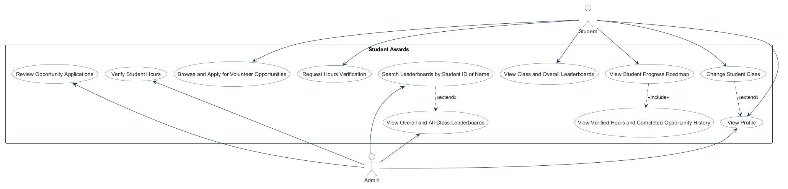
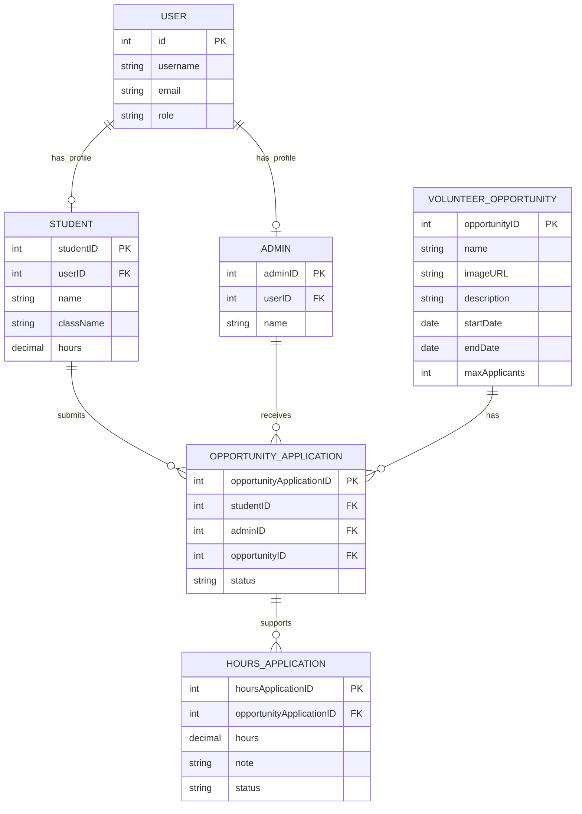
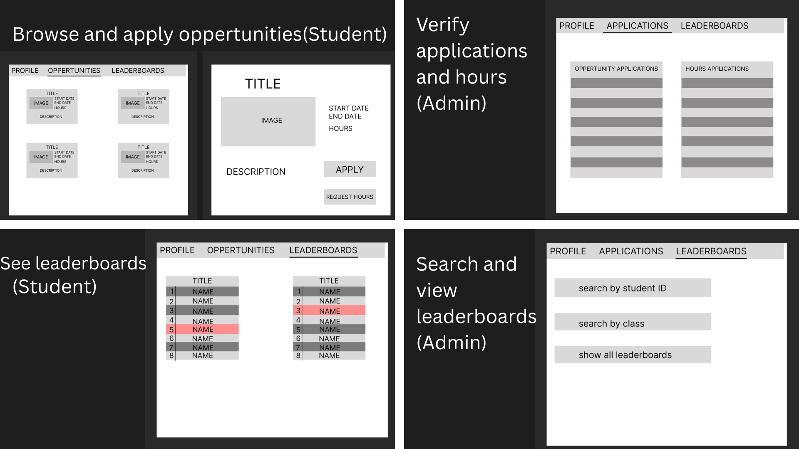

# COMP 3613 Assignment 1

Draft this file with the Guide. **Update it after every phase milestone** before you pause. The use-case diagram is a UML PNG at `docs/diagrams/use-case.png`, linked from this file as `diagrams/use-case.png` (path relative to `docs/report.md`). The model diagram is Mermaid. **Embed wireframe images** as `wireframes/<file>` (files live in `docs/wireframes/`).

Do not put your student ID in this file if you will commit it. The PDF cover adds your name and ID at export time.

## Assigned project
Student Awards (incentive system)

## Three workflows

### 1. Browse and Apply for Volunteer Opportunities (Student)

### 2. View Class and Overall Leaderboards (Student)

### 3. Verify Student Hours (Admin)

## Use case diagram

Revised use cases reflect the implemented workflows:

- Students browse and apply for volunteer opportunities; assigned admins review opportunity applications.
- Only accepted opportunity applications allow a student to request hours verification. Admins review hours requests and approved amounts update the student's total.
- Students can view the overall leaderboard and their own class leaderboard. Admins can view all classes and search by student ID or name.
- Students can view their profile and change their class. The student Progress roadmap shows verified hours, completed opportunities, and milestone progress.
- Viewing verified hours and completed opportunity history is included in the Progress roadmap; searching extends the admin leaderboard view; changing class extends profile viewing.

## Model diagram

Revised to match the implemented SQLModel tables. FastStarter `User` accounts remain the authentication records; separate `Student` and `Admin` profiles reference them one-to-one. `OpportunityApplication` links students, chosen admins, and opportunities. `HoursApplication` records each requested hour amount, note, and review status.

Leaderboards are query-derived views, not stored entities. Progress milestones are service-defined thresholds (8, 16, 24, and 32 verified hours), not separate database rows. Completed opportunity history is derived from accepted `HoursApplication` records.

Phase 3 relationship and rule decisions:

- A student can apply to many volunteer opportunities, and an opportunity can have applications from many students. `OpportunityApplication` is the linking entity and stores `studentID`, `adminID`, and `opportunityID`.
- Student and Admin are separate domain profiles linked one-to-one to FastStarter `User` login accounts.
- The student chooses the reviewing admin for each opportunity application. The same student and selected admin remain associated when hours are submitted for that opportunity application; `HoursApplication` stores the application reference, requested hour amount, note, and its own status.
- Both application types use `pending`, `accepted`, and `rejected` statuses. Admins verify hours through `HoursApplication`.
- An hours request can only be submitted for an accepted opportunity application. The student supplies a positive hour amount and a note.
- An opportunity requires a name, image URL, and description for its browse card.
- Leaderboard queries rank students by stored total hours. Students can only select the overall board or their own class; admins can select every class and search by exact student ID or partial name.
- Progress uses the student's verified total and marks milestones at 8, 16, 24, and 32 hours. The completed-opportunity list aggregates accepted hours requests per opportunity.
- Accepted opportunity applications consume capacity; pending applications do not. Admin approval is blocked when all places are taken. A student cannot submit while an application for that opportunity is pending, and cannot submit again after three denied applications for that opportunity.

## Wireframes

The current student-crafted wireframe sheet covers the three planned workflows: browse and apply for opportunities, verify applications and hours as admin, and view/search leaderboards.

`python manage.py report` also embeds any PNG/JPG still missing from `docs/wireframes/`.

## Theming

Brand direction: dark theme, modern design, readable typography, and smooth transitions. The palette now uses a near-black base, charcoal surfaces, blue and cyan accents, Space Grotesk headings, and DM Sans body text. The wordmark is Student Awards, with an encouraging, concise tone. Blue replaced the original green accents after the first workflow review.

Applied to the landing, login, and registration pages, with matching dark styling in the authenticated shell. Motion respects the reduced-motion preference. The generic signed-in home pages remain temporary workflow entry points and will be replaced as the student and admin workflows are implemented; `/config` remains available.

## Implementation notes

### Browse and Apply for Volunteer Opportunities (Student)

- Implemented opportunity cards with name, image URL, description, date range, capacity, and admin selection for applications.
- Applications track pending, accepted, or rejected status. Hours requests require an accepted application and include a positive amount and note.
- Seed data creates six opportunities and four student profiles across two classes. Every student starts at zero hours, and the database initializes with zero opportunity or hours applications.
- The leaderboard has an Overall tab and a tab for each class; students are ranked by their stored total hours.
- Student Progress roadmap uses the student's verified total hours and tracks Milestone 1 at 8 hours, Milestone 2 at 16, Milestone 3 at 24, and Milestone 4 at 32.
- The student Profile is for identity and class selection; total verified hours, milestone progress, and completed opportunity/hour history are shown on Progress.
- Student verification: the student reported that the first workflow looks good. Theme polish: changed the green/lime accents to blue/cyan at the student's request.
- Code checks: student completed the SQLModel fields, repository browse query, and thin route call. The service delegation was skipped and implemented as an assumption. The route calls the service and returns the HTML template; persistence stays in repositories.

## Deployed app

Phase 6. Public Render URL (not localhost). Markers open this to mark the three workflows.

https://

## Logins

Every account a marker needs, including extra users you added. Demo accounts:

- bob / bobpass — regular user, Class 1
- alice / alicepass — regular user, Class 1
- chris / chrispass — regular user, Class 2
- dana / danapass — regular user, Class 2
- admin / adminpass — admin

## YouTube URL

## Session transcripts

Filled when the Guide builds the report: the agent writes each Guide chat to `docs/transcripts/<slug>.md` (Copilot Agent, Cursor, or OpenCode). `python manage.py report` packages them. Do not paste chats here during the build.

## Competency (student-judge)

Filled when the report is built. Guide runs student-judge, writes `docs/judge.md`, and export appends the scorecard here.

## Skill integrity

Filled by `python manage.py report`. Do not edit the course skills.
